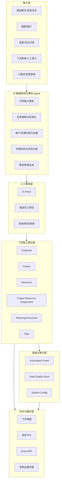

# 泽怀影像飞书业务中台 V2 项目指南

> 本文档是本项目的长期事实源（Source of Truth），供陈嘉伟、GPT、Trae 及后续协作者共同使用。  
> 所有代码、表结构、自动化和 AI Agent 的修改，必须与本文档保持一致。  
> 当前版本：`v1.0-draft`  
> 项目根目录建议：`D:\360Downloads\Trae 项目\SOP\`

---

## 0. 文档使用规则

### 0.1 事实源优先级

出现信息冲突时，按以下顺序判断：

1. 飞书当前真实表结构与真实数据
2. 当前 Git 仓库中通过测试的代码
3. `PROJECT_GUIDE.md` 中标记为 `APPROVED` 的决策
4. 最新的验收报告和迁移报告
5. 历史档案、旧 README、Trae 对话和旧截图

禁止根据旧文档直接假设线上表、自动化或接口仍然可用。

### 0.2 变更协议

任何结构性修改必须同时更新：

- 本文档的目标模型与状态
- `DECISION_LOG.md`
- 数据字典或 Schema 文件
- 迁移脚本
- 自动化测试
- 验收报告

不得只修改飞书界面而不更新代码和文档，也不得只修改代码而不验证真实 Base。

### 0.3 状态词定义

| 状态 | 定义 |
|---|---|
| `PLANNED` | 已设计，尚未实现 |
| `BUILDING` | 正在开发或迁移 |
| `PILOT` | 小范围真实数据验证 |
| `VERIFIED` | 有固定测试和真实运行证据 |
| `DEPRECATED` | 保留历史数据，不再新增 |
| `ARCHIVED` | 只读归档 |

“代码存在”“自动化已启用”“页面能打开”都不等于 `VERIFIED`。

---

# 1. 项目目标

## 1.1 业务目标

为 3 人摄影创业团队建立一套轻量、可维护、可追踪的业务操作系统，重点解决：

- 客户信息分散、跟进状态混乱
- 模特、化妆师等合作资源重复记录、难以筛选
- 策划案依赖个人经验，内容和版本不可追踪
- 自动化规则数量多但真实运行不稳定
- 微信聊天、截图、语音等非结构化信息无法稳定入库
- AI 输出缺少人工审核和可追溯证据

## 1.2 产品目标

V2 采用三层结构：

```text
飞书多维表：业务事实与状态
Serverless 自动化：跨表流程、幂等、重试、日志
AI Agent：清洗、提取、建议、策划草稿与质检
```

核心原则：

> 飞书保存已确认事实；自动化处理确定性流程；AI 只处理认知任务，并通过人工质量闸门写回核心数据。

## 1.3 本阶段非目标

V2 第一阶段不做：

- 完整 ERP、财务核算或复杂 CRM
- 完全无人值守的 AI 销售
- AI 自动确认付款、价格、合同或档期承诺
- 对现有 17 张表进行原地大规模破坏性修改
- 一次性恢复全部 12 条旧自动化
- 在表内保存完整策划案正文
- 为了作品集而制造未实际运行的功能

---

# 2. 当前状态判断

## 2.1 实际高频使用对象

当前真正高频使用的是：

- 客户
- 模特
- 化妆师
- 拍摄项目
- 策划案和拍摄准备信息

其他内容生产、发布、知识、场地、服装等模块可以保留，但不应继续与核心业务等权维护。

## 2.2 当前主要问题

1. 资源被拆成多张子表，公共字段重复，检索和去重困难。
2. 客户和项目字段较多，部分字段由历史设计驱动而非当前使用驱动。
3. 策划案与项目元数据没有清晰分工。
4. 旧自动化显示“已启用”，但没有稳定的运行日志、成功率和失败补偿。
5. API、粘贴、批量同步和人工修改可能触发重复流程。
6. AI 提取结果没有统一审核队列和写回协议。
7. 历史文档包含旧表名、旧字段和旧技术口径，容易造成长期记忆漂移。

## 2.3 迁移策略

采用“旁路重构”，而非直接在旧 Base 上重写：

```text
旧 Base：冻结结构，继续只读或低频使用
V2 Base：新建核心表、验证流程
迁移 Agent：清洗、匹配、人工确认、写入 V2
验证完成后：旧表转 ARCHIVED
```

禁止在没有备份和字段映射报告时删除旧表或旧字段。

---

# 3. V2 核心架构



---

# 4. V2 表结构

V2 首期建议 10 张表。核心业务只使用前 7 张，其余 3 张用于可靠性和治理。

## 4.1 `Customer` 客户表

### 目的

保存客户的权威身份、需求和关系状态。一个客户可以关联多个项目。

### 必需字段

| 字段 | 类型 | 说明 |
|---|---|---|
| `customer_id` | 文本/自动编号 | 稳定业务 ID，不使用 record_id 作为业务 ID |
| `customer_name` | 文本 | 昵称或称呼允许存在，但正式姓名单独记录 |
| `phone` | 电话/文本 | 统一为中国大陆或国际标准格式 |
| `wechat_name` | 文本 | 不作为唯一匹配键 |
| `source_channel` | 单选 | 小红书、微信、官网、小程序、转介绍、其他 |
| `relationship_status` | 单选 | 见客户状态机 |
| `intent_level` | 单选 | 高、中、低、未知 |
| `service_type` | 多选 | 个人、双人、品牌、创作、其他 |
| `preferred_style` | 多选 | 结构化风格标签 |
| `budget_min` | 数字 | 不使用模糊文本存储预算 |
| `budget_max` | 数字 | 可为空 |
| `preferred_date_start` | 日期 | 时间范围起点 |
| `preferred_date_end` | 日期 | 时间范围终点 |
| `owner` | 人员 | 当前跟进负责人 |
| `last_contact_at` | 日期时间 | 由真实跟进动作更新 |
| `next_action_at` | 日期时间 | 下一次应跟进时间 |
| `latest_summary` | 多行文本 | AI 可生成，人工确认后写入 |
| `privacy_level` | 单选 | 普通、敏感、高敏 |
| `created_at` / `updated_at` | 系统时间 | 保留审计 |

### 不建议保留

- 将多个项目状态复制到客户表
- 以备注字段混合保存地区、人数、喜好和预算
- 用公式状态触发关键自动化

---

## 4.2 `Project` 项目表

### 目的

表示一次正式交付。客户付定金或负责人确认立项后创建。

### 必需字段

| 字段 | 类型 | 说明 |
|---|---|---|
| `project_id` | 自动编号 | 稳定业务 ID |
| `customer_link` | 关联 Customer | 必须关联一个客户 |
| `project_name` | 文本 | 建议自动生成后允许人工修改 |
| `project_type` | 单选 | 客片、创作、品牌、其他 |
| `project_status` | 单选 | 见项目状态机 |
| `shoot_date_start` | 日期时间 | 可为空 |
| `shoot_date_end` | 日期时间 | 可为空 |
| `location_text` | 文本 | 首期允许文本，后续可关联资源 |
| `project_owner` | 人员 | 项目总负责人 |
| `photographer` | 人员/资源关联 | 团队内人员可用人员字段 |
| `planning_status` | 单选 | 未创建、草稿、待审核、已批准、需修改 |
| `planning_link` | 关联 Planning Document | 不在本表保存策划案正文 |
| `delivery_due_at` | 日期 | 交付 SLA |
| `risk_level` | 单选 | 正常、关注、高风险 |
| `risk_reason` | 多行文本 | 风险触发依据 |
| `folder_url` | URL | 项目文件夹 |
| `created_at` / `updated_at` | 系统时间 | 审计字段 |

---

## 4.3 `Resource` 统一资源表

### 目的

合并模特、化妆师、场地、服装、修图师等资源的公共信息，以“资源类型 + 视图”替代多张重复子表。

### 必需字段

| 字段 | 类型 | 说明 |
|---|---|---|
| `resource_id` | 自动编号 | 稳定业务 ID |
| `resource_type` | 单选 | 模特、化妆师、场地、服装、修图师、摄影师、其他 |
| `resource_name` | 文本 | 名称或称呼 |
| `contact` | 文本 | 按隐私级别控制可见性 |
| `city` | 单选/文本 | 建议统一城市字典 |
| `style_tags` | 多选 | 新中式、电影感、复古等 |
| `capability_tags` | 多选 | 发型、妆面、尺码、设备等公共标签 |
| `priority` | 单选 | S、A、B、待评估 |
| `cooperation_status` | 单选 | 未联系、沟通中、已合作、暂停、黑名单 |
| `availability_note` | 文本 | 首期不做完整排期系统 |
| `portfolio_url` | URL | 作品链接 |
| `price_min` / `price_max` | 数字 | 可为空 |
| `rating_quality` | 评分 | 质量 |
| `rating_reliability` | 评分 | 可靠性 |
| `last_cooperation_at` | 日期 | 最近合作 |
| `notes` | 多行文本 | 不得代替结构化字段 |
| `created_at` / `updated_at` | 系统时间 | 审计字段 |

### 资源视图

使用视图而非独立表：

- 模特库
- 化妆师库
- 场地库
- 服装库
- 修图师库
- S 级资源
- 待评估资源
- 杭州可用资源

### 类型特有字段

不建议在主表继续添加几十个稀疏字段。需要类型特有信息时使用：

- `resource_profile_json`：结构化 JSON，仅供 Agent 和 API 使用
- 或后续新增 `Resource Capability` 子表

V2 首期优先保持简单。

---

## 4.4 `Project_Resource_Assignment` 项目资源安排表

### 目的

解决“一个项目使用多个资源、一个资源参与多个项目”的多对多关系。

| 字段 | 类型 | 说明 |
|---|---|---|
| `assignment_id` | 自动编号 | 唯一编号 |
| `project_link` | 关联 Project | 必填 |
| `resource_link` | 关联 Resource | 必填 |
| `role_in_project` | 单选 | 主模特、备选模特、主化妆、场地等 |
| `booking_status` | 单选 | 候选、询价中、待确认、已确认、已取消 |
| `quoted_price` | 数字 | 报价 |
| `confirmed_price` | 数字 | 最终价格 |
| `start_at` / `end_at` | 日期时间 | 档期 |
| `conflict_status` | 单选 | 无冲突、疑似冲突、已冲突 |
| `owner` | 人员 | 跟进人 |
| `notes` | 文本 | 补充信息 |

这张表是资源推荐、档期冲突和策划案资源清单的关键中间层。

---

## 4.5 `Planning_Document` 策划案表

### 原则

多维表只保存策划案元数据、版本和审批状态。完整内容存储在飞书文档或 Wiki 中。

| 字段 | 类型 | 说明 |
|---|---|---|
| `planning_id` | 自动编号 | 策划案 ID |
| `project_link` | 关联 Project | 必填 |
| `version` | 数字/文本 | v1、v2 等 |
| `status` | 单选 | AI 草稿、人工编辑、待客户确认、已批准、已废弃 |
| `document_url` | URL | 飞书文档链接 |
| `template_version` | 文本 | 策划模板版本 |
| `ai_job_link` | 关联 AI Inbox | 生成来源 |
| `summary` | 多行文本 | 策划摘要 |
| `theme` | 文本 | 主题 |
| `style_tags` | 多选 | 风格 |
| `scene_plan` | 多行文本 | 场景摘要，不保存完整正文 |
| `wardrobe_plan` | 多行文本 | 服装摘要 |
| `makeup_plan` | 多行文本 | 妆造摘要 |
| `shot_list_summary` | 多行文本 | 分镜摘要 |
| `risk_notes` | 多行文本 | 风险与待确认问题 |
| `approved_by` | 人员 | 批准人 |
| `approved_at` | 日期时间 | 批准时间 |

### 策划案正文模板

飞书文档正文建议固定为：

1. 客户需求摘要
2. 项目目标
3. 主题与故事线
4. 视觉参考
5. 场景与时间安排
6. 妆造方案
7. 服装与道具
8. 模特或人物安排
9. Shot List
10. 光线与设备建议
11. 风险及备选方案
12. 客户待确认项
13. 执行清单
14. 版本记录

---

## 4.6 `Task` 任务表

首期只保存跨角色、需要 SLA 或需要证据的任务。

| 字段 | 类型 | 说明 |
|---|---|---|
| `task_id` | 自动编号 | 唯一 ID |
| `project_link` | 关联 Project | 可为空 |
| `task_type` | 单选 | 跟进、策划、资源确认、拍摄、后期、交付、复盘 |
| `title` | 文本 | 任务标题 |
| `status` | 单选 | 待处理、处理中、受阻、已完成、已取消 |
| `owner` | 人员 | 负责人 |
| `due_at` | 日期时间 | 截止时间 |
| `completed_at` | 日期时间 | 完成时间 |
| `evidence_url` | URL/附件 | 完成证据 |
| `source_event_id` | 文本 | 由哪个自动化创建 |
| `notes` | 文本 | 备注 |

---

## 4.7 `AI_Inbox` AI 审核队列

### 目的

所有 AI 生成的候选数据先进入此表，人工确认后才能写入核心事实表。

| 字段 | 类型 | 说明 |
|---|---|---|
| `ai_job_id` | 文本 | UUID |
| `task_type` | 单选 | 客户提取、资源提取、项目提取、策划生成、摘要、质检 |
| `source_type` | 单选 | 文本、截图、语音、表单、聊天记录、项目记录 |
| `source_url` | URL/附件 | 原始输入 |
| `source_text` | 多行文本 | OCR/ASR 后文本 |
| `target_entity` | 单选 | Customer、Resource、Project、Planning |
| `candidate_record_id` | 文本 | 可能匹配的已有业务 ID |
| `output_json` | 多行文本 | 符合 JSON Schema 的输出 |
| `confidence` | 数字 | 0—1 |
| `risk_level` | 单选 | Low、Medium、High |
| `validation_errors` | 多行文本 | 校验错误 |
| `review_status` | 单选 | 待审核、已采纳、已修改、已拒绝、执行失败 |
| `reviewer` | 人员 | 审核人 |
| `human_revision_json` | 多行文本 | 人工修改结果 |
| `writeback_target` | 文本 | 目标表和字段 |
| `writeback_result` | 多行文本 | 写回结果 |
| `model_name` | 文本 | 模型 |
| `prompt_version` | 文本 | Prompt 版本 |
| `latency_ms` | 数字 | 耗时 |
| `cost_estimate` | 数字 | 可选 |
| `created_at` / `reviewed_at` | 时间 | 审计 |

---

## 4.8 `Automation_Event` 自动化事件日志

所有 Serverless 自动化必须写日志。

| 字段 | 说明 |
|---|---|
| `event_id` | UUID |
| `event_type` | 事件类型 |
| `source_table` / `source_record_id` | 触发来源 |
| `idempotency_key` | 幂等键 |
| `rule_version` | 规则版本 |
| `input_snapshot` | 输入快照 |
| `status` | received、running、success、failed、manual_action |
| `started_at` / `completed_at` | 时间 |
| `retry_count` | 重试次数 |
| `output_summary` | 执行结果 |
| `error_code` / `error_message` | 错误信息 |
| `operator` | 人工补偿操作人 |

---

## 4.9 `Data_Quality_Issue` 数据质量问题表

记录：

- 重复客户
- 重复资源
- 无法匹配的字段
- 日期冲突
- 非法状态
- 缺失关键字段
- 关联记录丢失
- 资源档期冲突
- 写回失败

所有问题必须有状态、责任人和解决结果。

---

## 4.10 `System_Config` 配置表

只保存非敏感配置：

- 状态机版本
- Prompt 版本
- 自动化规则版本
- 风险阈值
- 枚举字典
- 策划模板版本

禁止保存：

- App Secret
- Access Token
- API Key
- 用户隐私明文导出

---

# 5. 状态机

## 5.1 客户状态机

```text
New Lead
→ Contacting
→ Qualified
→ Deposit Pending
→ Converted
→ Active Service
→ Completed
→ Repeat / Referral

任意阶段可进入 Lost
```

中文枚举建议：

- 新线索
- 跟进中
- 已确认需求
- 待定金
- 已成交
- 服务中
- 已完成
- 复购/转介绍
- 已流失

客户状态只描述商业关系，不复制项目具体交付状态。

## 5.2 项目状态机

```text
Draft
→ Planning
→ Planning Approved
→ Resource Confirming
→ Ready to Shoot
→ Shooting Completed
→ Post Production
→ Client Review
→ Delivered
→ Archived
```

中文枚举建议：

- 草稿
- 策划中
- 策划已批准
- 资源确认中
- 待拍摄
- 拍摄完成
- 后期制作
- 客户确认
- 已交付
- 已归档

### 状态规则

- 不允许跨越关键状态直接更新，除非管理员填写例外原因。
- AI 不得直接修改项目状态。
- 公式字段不得作为关键自动化触发源。
- 所有状态变化写入 `Automation_Event` 或变更日志。

---

# 6. 自动化 V2

## 6.1 原则

首期只恢复 8 条真正有价值、可验证的规则。旧 12 条规则先导出配置，然后统一设为 `DEPRECATED` 或关闭，避免双重触发。

## 6.2 保留在飞书原生的规则

### F1 客户跟进每日汇总

- 每天 09:00
- 查询 `next_action_at <= today` 且客户未完成或未流失
- 发送一张汇总卡片，不逐条循环通知
- 记录汇总数量和接收人

### F2 项目节点每日汇总

- 每天 09:00
- 查询未来 3 天拍摄、已超期交付、待客户确认项目
- 按负责人汇总发送

### F3 AI 审核待办提醒

- 每天两次或新增高风险记录时提醒
- High 风险即时提醒
- Medium 风险进入每日汇总

飞书原生只负责简单提醒，不承担跨表写入和多步骤补偿。

## 6.3 Serverless 自动化

### S1 定金确认后创建项目草稿

触发：`Customer.deposit_status = confirmed` 或人工点击“创建项目”。

步骤：

1. 验证客户必填字段
2. 检查幂等键
3. 创建 Project 草稿
4. 关联 Customer
5. 创建策划任务
6. 记录 Automation Event
7. 通知负责人

AI 不判断付款是否真实到账。

### S2 项目创建后生成策划案草稿

1. 收集客户需求和项目元数据
2. 调用 Planning Agent
3. 创建飞书文档
4. 写入 Planning Document 元数据
5. 状态设为“AI 草稿”
6. 通知项目负责人审核

### S3 策划案批准后生成执行任务

按策划模板生成：

- 资源确认任务
- 场地确认任务
- 客户待确认任务
- 拍摄准备任务
- 设备与道具任务

禁止在策划草稿阶段直接生成正式执行任务。

### S4 资源安排冲突检查

当 Assignment 新建或时间变化时：

1. 查询同一 Resource 的重叠档期
2. 无冲突：标记通过
3. 疑似冲突：标记并通知负责人
4. 不自动取消任何安排

### S5 项目状态更新客户关系状态

只允许单向、受控更新：

- 第一个有效项目进入“待拍摄”后，客户可进入“服务中”
- 所有项目已交付后，客户可进入“已完成”
- 不允许项目状态直接覆盖“复购/转介绍”或“已流失”

### S6 项目交付后创建复盘任务

创建：

- 满意度回访任务
- 客户反馈摘要任务
- 资源评价任务
- SOP 改进候选

### S7 AI 审核写回

只有 `review_status = 已采纳/已修改` 才能执行写回。

写回前：

- 再次验证 Schema
- 比较目标记录最新版本
- 发现并发修改则停止并要求人工合并
- 记录字段级修改内容

### S8 自动化失败汇总

每天发送：

- 失败事件数
- 重试后仍失败数
- 需要人工处理数
- 最高频错误代码

---

# 7. AI 数据清洗 Agent

## 7.1 Agent 责任

负责：

- OCR / ASR / 文本解析
- 客户、资源、项目、策划实体识别
- 字段标准化
- 去重和候选匹配
- 置信度评估
- 输出候选写入内容
- 生成策划草稿

不负责：

- 确认付款
- 承诺价格和档期
- 自动删除记录
- 自动覆盖人工修改
- 自动公开发布内容
- 自动批准策划案

## 7.2 处理管线

```text
接收输入
→ 保存原始快照
→ OCR/ASR
→ 输入分类
→ 实体提取
→ 标准化
→ 候选匹配
→ 业务规则校验
→ 风险分级
→ 写入 AI Inbox
→ 人工审核
→ 幂等写回
→ 记录结果
```

## 7.3 去重策略

### 客户匹配

优先级：

1. 标准化手机号完全一致
2. 微信号完全一致
3. 姓名 + 来源 + 时间窗口
4. 姓名 + 项目上下文的模糊匹配

AI 只能给出候选，不能在低置信度时直接合并客户。

### 资源匹配

优先级：

1. 联系方式
2. 作品链接或社交账号
3. 资源类型 + 名称 + 城市
4. 名称相似度 + 备注上下文

## 7.4 风险等级

| 风险 | 条件 | 行为 |
|---|---|---|
| Low | 标签、摘要、非关键备注 | 可批量审核，允许批准后自动写回 |
| Medium | 客户需求、预算、日期、资源匹配 | 必须逐条人工审核 |
| High | 价格、付款、合同、档期承诺、删除、合并 | 不允许自动写回 |

## 7.5 输出规范

所有 Agent 输出必须：

- 使用 JSON
- 符合 `schemas/ai_ingest_output.schema.json`
- 包含字段级置信度
- 包含证据片段
- 包含未解决问题
- 禁止输出未在 Schema 中定义的核心字段

---

# 8. 策划案 Agent

## 8.1 输入

- 客户需求摘要
- 项目类型
- 风格标签
- 预算范围
- 拍摄人数
- 日期与地点约束
- 已确认资源
- 历史类似案例
- SOP 和知识库引用

## 8.2 输出

输出必须区分：

- 已确认事实
- Agent 建议
- 客户待确认
- 团队待确认
- 风险与备选

不得把建议写成已确认事实。

## 8.3 策划案生成原则

1. 先生成结构化 JSON
2. 再渲染飞书文档
3. 文档必须显示引用来源
4. 版本不可覆盖，必须创建新版本或保留历史
5. 客户确认和内部批准分开记录

## 8.4 策划质量评测

至少建立 10 个脱敏历史项目作为测试集，人工评分：

- 需求覆盖度
- 风格一致性
- 可执行性
- 资源合理性
- 风险识别
- 待确认项完整度
- 人工修改比例
- 策划生成耗时

---

# 9. 可靠性与安全

## 9.1 幂等

所有写操作必须携带：

```text
idempotency_key = source_record_id + event_type + rule_version
```

同一个幂等键不得创建第二条业务记录。

## 9.2 并发控制

写回前读取目标记录的 `updated_at` 或版本字段。若从 AI 生成到写回期间记录已被修改：

- 不自动覆盖
- 写入冲突问题
- 请求人工确认

## 9.3 重试

- 网络错误、429、5xx：指数退避重试
- Schema 错误、权限错误、字段不存在：不自动重试
- 最大自动重试 3 次
- 超过后进入人工补偿队列

## 9.4 隐私

- 任何公开截图必须脱敏手机号、客户姓名、内部链接和 record_id
- 原始聊天和客户照片不进入公开仓库
- 飞书 App Secret 和模型 API Key 仅放环境变量
- 日志不记录完整敏感输入，只保存脱敏摘要和哈希
- AI 训练数据必须另行确认授权，不默认使用客户数据

## 9.5 禁止硬编码

代码中禁止硬编码：

- Base App Token
- Table ID
- Field ID
- App Secret
- Access Token
- API Key
- 人员 Open ID

所有资源标识通过环境变量或映射配置加载，并提供示例配置文件但不提交真实值。

---

# 10. 迁移方案

## Phase 0：审计与冻结

交付物：

- 当前 Base 全量表、字段、视图、自动化导出
- 当前数据量统计
- 旧自动化实际执行日志
- 旧代码和配置备份
- 资源标识脱敏映射

验收条件：

- 可以从备份恢复
- 没有修改线上数据
- 明确哪些自动化实际运行过

## Phase 1：创建 V2 Base

创建：

- Customer
- Project
- Resource
- Project Resource Assignment
- Planning Document
- Task
- AI Inbox
- Automation Event
- Data Quality Issue
- System Config

验收条件：

- 字段与本文档一致
- 必填、枚举和关联验证通过
- 所有 Table ID 和 Field ID 写入本地配置映射
- 不包含真实 Secret

## Phase 2：资源与客户清洗迁移

顺序：

1. 模特和化妆师迁入统一 Resource
2. 客户迁入 Customer
3. 项目迁入 Project
4. 生成 Project Resource Assignment
5. 原始记录保留 `legacy_source` 和 `legacy_record_id`

验收条件：

- 总数对账
- 重复项单独列出
- 零静默丢失
- 所有人工合并有记录

## Phase 3：自动化 MVP

先实现：

- S1 定金创建项目草稿
- S2 项目创建生成策划草稿
- S4 资源冲突检查
- S7 AI 审核写回
- S8 失败汇总

每条规则必须有：

- 单元测试
- 集成测试
- 重复事件测试
- 失败重试测试
- 人工补偿说明

## Phase 4：AI Agent

先支持三种输入：

1. 微信聊天复制文本
2. 截图 OCR
3. 语音 ASR

先支持三类目标：

1. 客户候选
2. 资源候选
3. 策划草稿

## Phase 5：APP 适配

APP 首期只保留：

- 今日看板
- 客户
- 项目
- 资源
- AI 审核
- 任务

旧的内容发布、爆款和知识模块可作为二期插件，不进入核心导航。

## Phase 6：真实业务 Pilot

使用至少：

- 10 名脱敏客户
- 10 个资源
- 3 个项目
- 3 份策划案
- 20 条 AI Inbox 任务

完成后才能标记 `PILOT`。

---

# 11. 测试与验收

## 11.1 数据模型测试

- 必填字段为空时拒绝写入
- 无效枚举拒绝写入
- 关联记录不存在时拒绝写入
- 手机号标准化正确
- 日期范围合法
- 同一资源同一时间的冲突可检测

## 11.2 自动化测试

每条自动化至少测试：

- 正常路径
- 重复事件
- 源记录缺字段
- 目标记录已存在
- API 超时
- 飞书 429
- 权限不足
- 字段被人工修改
- 人工补偿

## 11.3 AI Agent 测试

至少准备：

- 30 条客户聊天
- 20 条资源资料
- 10 份策划输入
- 10 条低质量或冲突输入
- 10 条提示注入或越权请求

输出指标：

- 字段准确率
- 候选匹配准确率
- 人工修改率
- 错误写入率
- 拒绝正确率
- P50 / P95 延迟
- 单次成本估算

## 11.4 验收门槛

V2 进入 `VERIFIED` 前必须满足：

- 自动化重复创建记录数 = 0
- 高风险 AI 自动写回数 = 0
- 数据迁移静默丢失数 = 0
- 自动化失败有日志覆盖率 = 100%
- AI 写回有人工审核记录覆盖率 = 100%
- 核心流程可通过录屏复现

---

# 12. 代码和目录规范

建议目录：

```text
SOP/
├── PROJECT_GUIDE.md
├── DECISION_LOG.md
├── README.md
├── docs/
│   ├── current-state-audit.md
│   ├── data-dictionary-v2.md
│   ├── migration-report.md
│   ├── automation-spec.md
│   ├── ai-evaluation-report.md
│   └── acceptance-report.md
├── config/
│   ├── resource-map.example.json
│   ├── state-machines.json
│   └── prompt-versions.json
├── schemas/
│   ├── ai_ingest_output.schema.json
│   └── planning_output.schema.json
├── src/
│   ├── feishu/
│   ├── automation/
│   ├── agents/
│   ├── migration/
│   ├── validation/
│   └── shared/
├── tests/
│   ├── unit/
│   ├── integration/
│   ├── fixtures/
│   └── evaluation/
└── scripts/
    ├── export-current-state.*
    ├── backup-base.*
    ├── create-v2-base.*
    ├── migrate-resources.*
    └── verify-migration.*
```

## 命名规范

- 代码变量：英文 `snake_case` 或项目既有规范
- 飞书显示名：中文
- 稳定字段键：英文，不依赖显示名
- 自动化名称：`[层级]-[对象]-[动作]-[版本]`
- Prompt：`<task>-v<major>.<minor>`
- Schema：版本化，不覆盖历史

---

# 13. Trae 工作规则

Trae 在每次执行前必须：

1. 阅读本指南
2. 输出当前理解和计划
3. 检查真实目录与真实配置
4. 不假设旧自动化可用
5. 先备份再修改
6. 一次只完成一个 Phase 或一个可验证子任务
7. 修改后执行测试
8. 输出变更文件列表
9. 输出实际验证证据
10. 更新 Decision Log 和验收报告

Trae 禁止：

- 在未确认字段映射时批量写入真实 Base
- 直接删除旧表或旧记录
- 以“已启用”替代真实执行验证
- 编造运行结果、指标或截图
- 将测试数据和真实客户数据混合
- 直接把 AI 输出写入核心事实表
- 在仓库中提交真实 Token 和 Secret
- 未经批准扩大范围到内容发布、增长工具或其他项目

---

# 14. 当前批准决策

| 编号 | 决策 | 状态 |
|---|---|---|
| D-001 | 采用飞书作为当前长期业务事实主库 | APPROVED |
| D-002 | 模特、化妆师等资源合并为统一 Resource 表，通过视图区分 | APPROVED |
| D-003 | 采用飞书 + Serverless 混合自动化 | APPROVED |
| D-004 | 低风险 AI 可在人工批准后写回，高风险永远人工确认 | APPROVED |
| D-005 | AI 数据清洗 Agent 作为非结构化数据入库入口 | APPROVED |
| D-006 | 策划案正文存飞书文档，表格只存元数据和版本 | APPROVED |
| D-007 | 旧 12 条自动化不视为已跑通，先审计、冻结，再按 V2 重建 | APPROVED |
| D-008 | V2 先服务客户、项目、模特、化妆师和策划案，不追求全业务覆盖 | APPROVED |

---

# 15. 下一步唯一正确起点

Trae 首次执行不得直接创建 V2 表或修改自动化。

第一任务必须是：

> **完成 Phase 0：当前状态审计、配置备份、真实数据统计和旧自动化运行证据检查。**

Phase 0 完成并由用户确认后，才能进入 V2 Base 创建。

