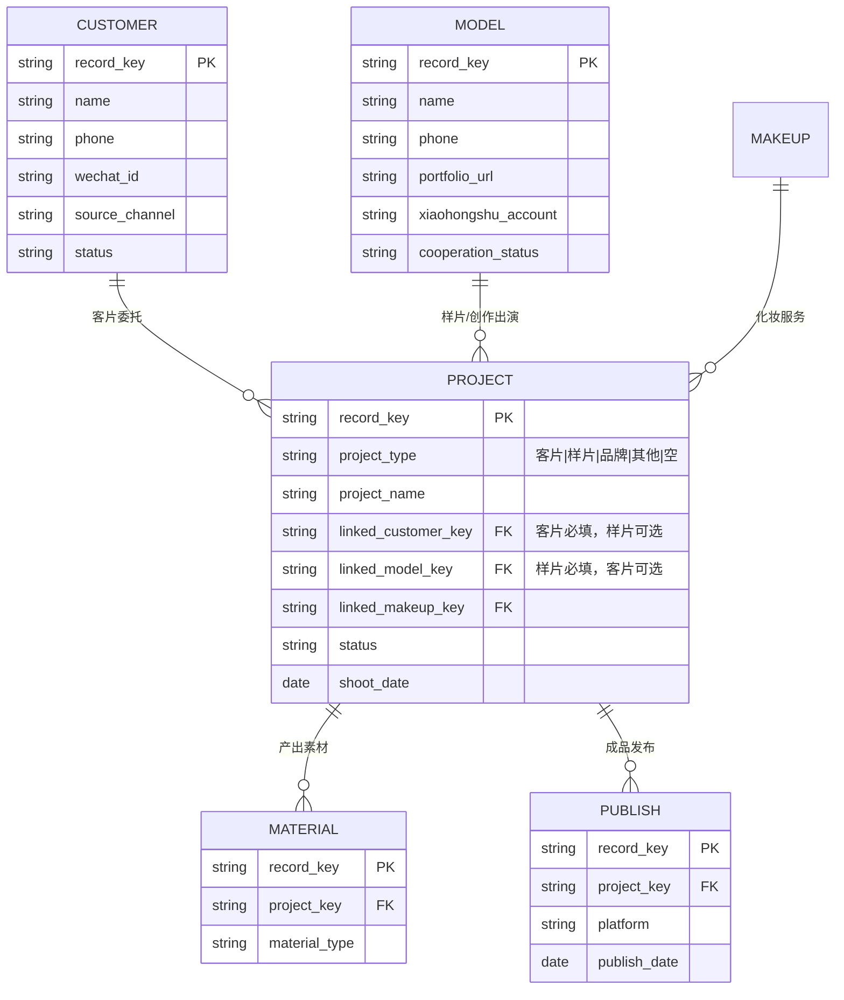

# 飞书业务数据中台：求职展示证据

> 本文档为对外可展示的求职证据汇编。所有内容经过匿名化处理，不包含真实客户姓名、模特姓名、项目名称、record ID、联系方式或其他可识别业务身份的信息。文档仅描述业务规则、数据结构、分类逻辑和迁移准备度，不涉及任何真实业务记录的细节。

---

## 1. 项目公开状态

**业务系统已投入使用｜V2 标准化迁移准备中**

- 现有飞书业务系统（多维表格 + 电子表格 + 12 条自动化规则）正在承载真实业务流程，覆盖客户管理、项目执行、资源调度、素材分发等环节。
- V2 标准化迁移尚未启动。本任务（PROJECT-TYPE-SOURCE-OF-TRUTH-CORRECTION-01-R2）只完成"规则修正 + 准备度评估 + 求职证据收口"，未执行任何真实迁移写入。
- MIGRATION_PILOT_001 仍在审批门前等待，未获批准。

---

## 2. 业务问题

原始业务系统在长期使用过程中形成了以下标准化挑战：

1. **数据分散**：业务数据分布在多张电子表格与多维表格中，字段命名、枚举值、关联方式不统一。
2. **项目类型语义模糊**：V1 阶段存在"客片 / 创作 / 样片 / 品牌 / 其他"等多种类型表述，"创作"与"样片"在业务语义上等价但字面不同，导致关联要求不一致。
3. **关联要求一刀切**：早期规则假设"所有项目都必须关联 Customer"，但实际业务中：
   - 客片必须关联 Customer（客户委托拍摄）
   - 样片/创作只需关联 Model（自主创作，客户字段可空）
   - 类型为空的项目无法判定关联对象
4. **迁移准备度评估口径偏差**：旧 D-026 评估因口径错误，把"样片缺 Customer"误判为关联缺失，掩盖了真实的关联缺陷（样片缺 Model）。

本任务通过 R1 + R2 两轮修正解决了上述问题。

---

## 3. 核心业务规则

### 3.1 项目类型与关联要求

| 项目类型 | V1 表述 | V2 规范 | 必须关联 | 可选关联 | 类型为空时 |
|---------|---------|---------|---------|---------|-----------|
| 客片 | 客片 | 客片 | Customer | Model | - |
| 样片 | 创作 / 样片 | 样片 | Model | Customer | - |
| 品牌 | 品牌 | 品牌 | Customer | Model | - |
| 其他 | 其他 | 其他 | Customer | Model | - |
| 空值 | 空 | 空 | - | - | NEEDS_REVIEW / PROJECT_TYPE_REQUIRED |

### 3.2 ORPHAN_PROJECT 触发条件

- 客片 + Customer 缺失 → ORPHAN_PROJECT（关联缺失）
- 样片 + Model 缺失 → ORPHAN_PROJECT（关联缺失）
- 样片 + Customer 缺失 → **合法，不触发 ORPHAN_PROJECT**
- 项目类型为空 → **不触发 ORPHAN_PROJECT**，由 PROJECT_TYPE_REQUIRED 处理（NEEDS_REVIEW）
- 项目无法匹配权威来源（项目统计表）→ **不触发 ORPHAN_PROJECT**，由 PROJECT_SOURCE_MATCH_REQUIRED 处理（NEEDS_REVIEW）

### 3.3 不可猜测原则

项目类型为空时，分类器不得根据客户、模特、名称或其他字段猜测类型。必须输出 `NEEDS_REVIEW / PROJECT_TYPE_REQUIRED`，由人工复核后补录。

---

## 4. 数据关系图

**关系规则要点：**
- 客片项目必须存在 `linked_customer_key → CUSTOMER` 的关联
- 样片项目必须存在 `linked_model_key → MODEL` 的关联
- 客片项目的 `linked_model_key` 可选（如有则必须指向 Model 记录，否则触发 LINKED_ENTITY_TYPE_MISMATCH）
- 样片项目的 `linked_customer_key` 可选（如有则必须指向 Customer 记录）

---

## 5. 匿名案例

### Case A：客片项目（合法可迁移）

| 维度 | 内容 |
|------|------|
| 匿名项目编号 | PROJECT-ALIAS-A |
| 权威项目类型 | 客片 |
| 关联实体 | CUSTOMER-ALIAS-A（已关联） |
| 当前关联状态 | linked_customer_key 已填写且解析到 Customer 记录 |
| 修正后分类结果 | MIGRATABLE |
| 修正理由 | 客片类型，已关联 Customer，满足类型对应的关联要求。Model 关联可选，未填写不构成阻塞。 |

**对应测试场景**：T-01 正常客片（客片 + Customer → 可迁移或通过分类）

### Case B：样片项目（合法，Customer 为空不触发 ORPHAN）

| 维度 | 内容 |
|------|------|
| 匿名项目编号 | PROJECT-ALIAS-B |
| 权威项目类型 | 样片（V1 表述"创作"已规范化） |
| 关联实体 | MODEL-ALIAS-B（已关联）；Customer 字段为空 |
| 当前关联状态 | linked_model_key 已填写且解析到 Model 记录；linked_customer_key 为空 |
| 修正后分类结果 | MIGRATABLE |
| 修正理由 | 样片类型，已关联 Model 即满足类型对应的关联要求。Customer 字段为空属于合法状态，不触发 ORPHAN_PROJECT。 |

**对应测试场景**：T-03 正常样片（样片 + Model + Customer 为空 → 合法，不是 ORPHAN）

### Case C：项目类型缺失（NEEDS_REVIEW）

| 维度 | 内容 |
|------|------|
| 匿名项目编号 | PROJECT-ALIAS-C |
| 权威项目类型 | 空（项目统计表中未明确该项目的类型） |
| 关联实体 | 无（无法判定应关联 Customer 还是 Model） |
| 当前关联状态 | linked_customer_key 与 linked_model_key 均为空 |
| 修正后分类结果 | NEEDS_REVIEW |
| 主原因码 | PROJECT_TYPE_REQUIRED |
| 修正理由 | 项目类型为空时，分类器不得根据其他字段猜测类型。必须输出 NEEDS_REVIEW，等待人工补录项目类型后再判定关联要求。 |

**对应测试场景**：T-07 类型缺失（空 + 任意 → NEEDS_REVIEW）

### Case B'：样片缺 Model（关联缺失/阻塞，作为 Case B 的对照）

| 维度 | 内容 |
|------|------|
| 匿名项目编号 | PROJECT-ALIAS-B-PRIME |
| 权威项目类型 | 样片 |
| 关联实体 | 无（Model 字段为空） |
| 当前关联状态 | linked_model_key 为空 |
| 修正后分类结果 | BLOCKED |
| 主原因码 | ORPHAN_PROJECT |
| 修正理由 | 样片类型必须关联 Model。Model 缺失即触发 ORPHAN_PROJECT。Customer 字段是否填写不影响此判定。 |

**对应测试场景**：T-05 样片缺模特（样片 + Model 缺失 → 失败或阻塞）

---

## 6. 迁移准备度证据卡

| 维度 | 状态 | 公开说明 |
|------|------|---------|
| 业务系统使用 | 已投入使用 | 现有飞书业务系统承载真实业务流程 |
| 项目类型规则 | 已修正并验证 | 客片关联 Customer，样片关联 Model；类型为空进入 NEEDS_REVIEW |
| 旧数据整理 | 已执行 | 已进行数据盘点、分类和问题识别；47 个项目已与权威项目统计表比对 |
| D-026 准备度 | **FAIL（未通过）** | 真实重评结果：project MIGRATABLE=1/5（缺口 4）；makeup=9/10（缺口 1）；样片 Model 完整率 0/18=0% < 100%；合计正确关联对 1 < 5 |
| 自动化测试 | 已执行并通过 | 177 测试全部通过（95 投影 + 62 分类器 + 20 公开仓库扫描） |
| V2 真实迁移 | **未执行** | 等待 MIGRATION_PILOT_001 批准；本任务未触发任何真实写入 |
| 生产写入 | **未执行** | 本任务全程禁止真实写入，仅运行测试与评估 |

**D-026 未通过的具体原因**（基于真实 R1 重跑结果）：
1. 47 个项目中仅 1 个 MIGRATABLE Project，低于阈值 5（缺口 4）
2. 18 个样片项目中 0 个具有有效的 Model 关联（样片 Model 完整率 0/18 = 0%）
3. 10 个 Makeup 中仅 9 个 MIGRATABLE（缺口 1）
4. 合计正确关联对 1 < 5（仅 P-01 客片具有有效 Customer 关联）

**MIGRATION_PILOT_001 不得启动**，直至上述阻塞项全部解决。

---

## 7. 验证证据

### 7.1 测试命令与结果

| 命令 | 退出码 | 结果 |
|------|--------|------|
| `node --test tests/migration-projection.test.js` | 0 | 95 通过 / 0 失败 |
| `node --test tests/migration-classifier.test.js` | 0 | 62 通过 / 0 失败 |
| `python -m unittest tests.test_verify_public_repo` | 0 | 20 通过 / 0 失败 |
| **合计** | 0 | **177 通过 / 0 失败** |

### 7.2 关键回归测试覆盖

| 测试 ID | 场景 | 预期 | 实际 |
|---------|------|------|------|
| T-01 | 正常客片 + Customer | 通过分类 | ✓ |
| T-02 | 客片缺客户 | 关联缺失/阻塞 | ✓ |
| T-03 | 正常样片 + Model + Customer 空 | 合法，不是 ORPHAN | ✓ |
| T-04 | 正常创作 + Model | 与样片相同，合法 | ✓ |
| T-05 | 样片缺模特 | 关联缺失/阻塞 | ✓ |
| T-06 | 创作缺模特 | 关联缺失/阻塞 | ✓ |
| T-07 | 类型缺失 | NEEDS_REVIEW | ✓ |
| T-08 | 未知类型 | NEEDS_REVIEW，不猜测 | ✓ |
| T-09 | 客户实体回归 | 原 Customer 分类行为不变 | ✓ |
| T-10 | 模特实体回归 | 原 Model 分类行为不变 | ✓ |
| T-11 | 投影安全 | 未批准时无真实写入 | ✓ |
| T-12 | D-026 | 仅按类型对应关联计算 | ✓ |

### 7.3 D-026 重评前后对比

| 项 | 旧口径（R0） | 新口径（R2） |
|----|------------|------------|
| 评估口径 | 所有项目均要求 Customer | 客片要求 Customer；样片要求 Model；类型空进入 NEEDS_REVIEW |
| 样片缺 Customer 是否计为失败 | 是（误判） | 否（合法，不进入失败项） |
| 样片缺 Model 是否计为失败 | 否（被掩盖） | 是（真实阻塞项） |
| per-type 完整性分母 | 仅 MIGRATABLE 项目（自证循环） | 所有 MATCHED 项目（按权威身份） |
| 客片 Customer 完整率 | - | 1/1 = 100% ✓ |
| 样片 Model 完整率 | - | 0/18 = 0% ✗ |
| D-026 总体结果 | FAIL | **FAIL**（未通过，未降低门槛） |

### 7.4 真实迁移写入证据

- 本任务全程未调用任何 V2 写入接口
- 测试用例使用合成 fixture（如 `PROJECT_ALIAS_R2_*`、`CUSTOMER_ALIAS_*`），不引用真实 record ID
- 投影函数 `projection.js` 含 fail-closed defense-in-depth：分类不是 MIGRATABLE 时抛出异常，绝不生成可写 payload
- `scripts/verify_public_repo.py` 扫描通过：公开仓库不包含真实客户/模特/项目身份信息

---

## 8. 展示边界

### 8.1 已完成

- 旧业务数据整理：47 个项目与权威项目统计表比对，44 个 MATCHED / 3 个 MATCH_NOT_FOUND
- 分类规则验证：项目类型规则按客片/样片/类型空三类分别定义关联要求，并通过 177 项测试验证
- 迁移准备度评估：D-026 重评完成，明确剩余阻塞项（样片 Model 关联完整率、Makeup MIGRATABLE 计数、合计正确关联对）
- 求职证据收口：本文档完整呈现业务规则、数据关系、匿名案例和准备度证据

### 8.2 未完成

- V2 标准化真实迁移：**未执行**。MIGRATION_PILOT_001 未获批准，本任务未触发任何真实写入
- 真实生产写入：**未执行**。本任务全程禁止真实写入

### 8.3 不得出现的表述

本文档不包含、也不得引用以下未经真实迁移验证的陈述：
- ~~"V2 已完成 111 条迁移、0 失败"~~
- ~~"所有项目必须关联 Customer"~~
- ~~"V2 已完成迁移"~~
- ~~"生产迁移已验证"~~

---

## 附录：本任务对应的代码与文档位置

| 类型 | 路径 | 说明 |
|------|------|------|
| 分类器 | `src/migration/classifier/classifier.js` | `isOrphanProject` 按项目类型分支 |
| 原因码 | `src/migration/classifier/reason-codes.js` | `PROJECT_TYPE_REQUIRED`、`PROJECT_SOURCE_MATCH_REQUIRED` |
| D-026 评估器 | `src/migration/d026-evaluator.js` | R2 分母解耦、per-type 100% 完整性 |
| V1 字段解析 | `src/migration/v1-field-resolver.js` | 解析 V1 关联字段并检测类型错配 |
| 投影 | `src/migration/projection.js` | fail-closed 防御性校验 |
| 投影测试 | `tests/migration-projection.test.js` | 95 项测试，含 R1-3~R1-7、R2-1~R2-6 |
| 分类器测试 | `tests/migration-classifier.test.js` | 62 项测试，含原因码优先级 |
| 公开仓库扫描 | `tests/test_verify_public_repo.py` | 20 项测试，扫描公开仓库是否含真实身份信息 |
| 重跑结果（私密） | `backups/private/r1-rerun-result.private.json` | 真实 R1 重跑输出（含 D-026 FAIL 证据） |
| P-01~P-08 矩阵（私密） | `backups/private/p01-p08-rerun-result.private.json` | P-01~P-08 修正前后对比（含真实 record ID，不入公开仓库） |

---

## 声明

本文档仅证明基于现有测试和提交证据完成规则修正与展示材料准备，**不代表 MIGRATION_PILOT_001 已执行或 V2 真实迁移已完成**。所有 D-026 结果均为真实重跑输出，未通过降低门槛或改写口径制造 PASS。
